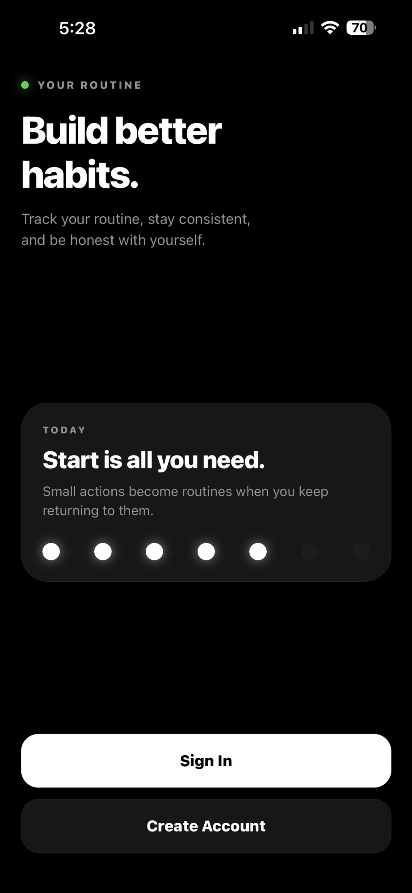
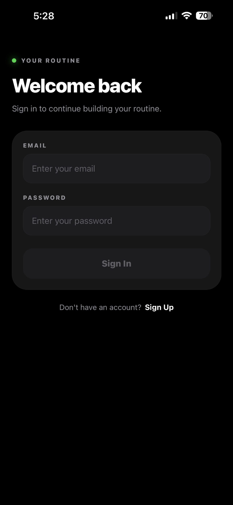
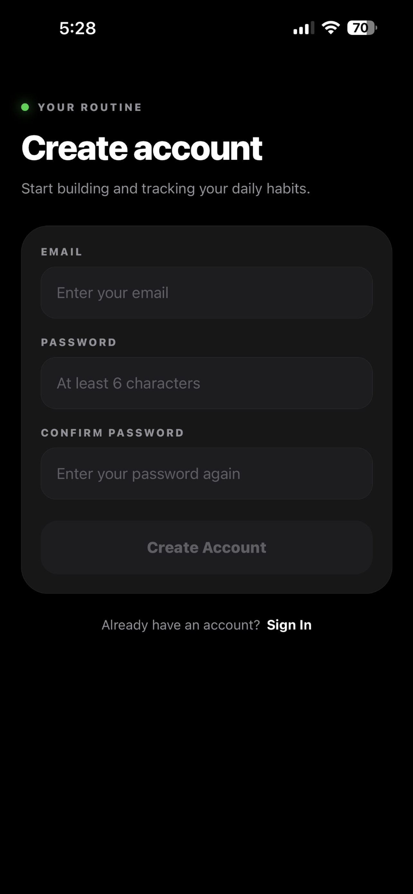
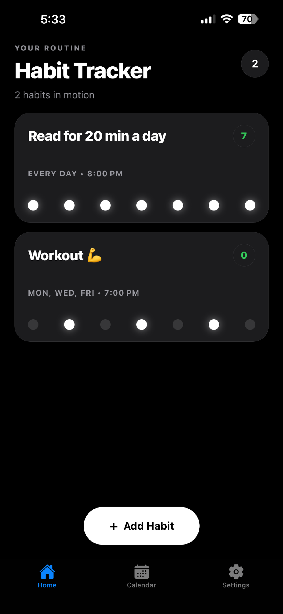
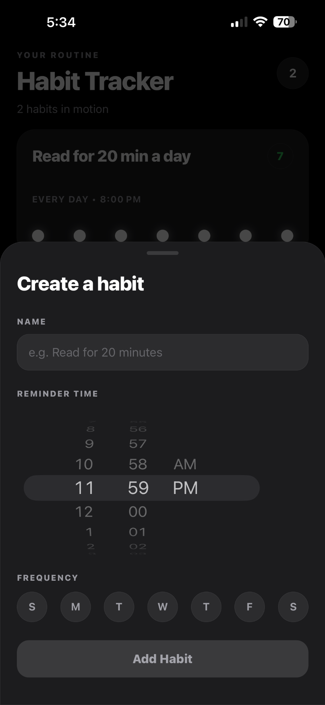
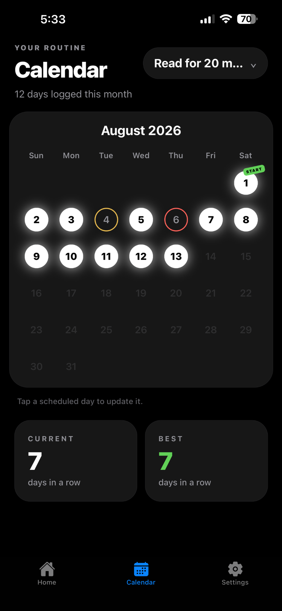

# Habit Tracker

A mobile habit-tracking app built around quick daily check-ins. Users can create recurring habits, receive scheduled reminders, record progress through a notification flow, and review their history and streaks in a calendar.

## App Preview

### Get Started

<p align="center">
  
  
  
</p>

### Track Your Routine

<p align="center">
  
  
  
</p>

## Features

- Email and password authentication
- Create and delete habits
- Custom weekly schedules and reminder times
- Local iOS notifications for scheduled habits
- Dedicated notification check-in flow
- Calendar-based progress history
- Current and best streak tracking
- Persistent user sessions
- Dark, mobile-first interface

## Tech Stack

### Mobile App

- React Native
- Expo
- Expo Router
- TypeScript
- Expo Notifications
- React Native Reanimated

### Backend

- Node.js
- Express
- TypeScript
- Supabase Authentication
- PostgreSQL
- Supabase Row Level Security

## Architecture

The Expo app authenticates users through Supabase and sends authenticated requests to the Express API.

The API validates the user's access token and performs database operations through a request-scoped Supabase client. Supabase Row Level Security policies ensure that users can only access their own data.

```text
Expo Mobile App → Express API → Supabase
```

Habit reminders are scheduled locally on the device. When a user opens a reminder, the app navigates to a focused check-in screen and records the selected response through the API.

## Project Structure

```text
app/          Expo Router screens and layouts
assets/       App icons, screenshots, and static assets
components/   Reusable interface components
constants/    Shared application constants
hooks/        Custom React hooks
server/       Express backend
types/        Shared TypeScript types
utils/        Date, notification, streak, and Supabase utilities
```

## Getting Started

### Prerequisites

- Node.js
- npm
- Expo Go
- A Supabase project

### Installation

Clone the repository:

```bash
git clone https://github.com/johnnyleeom/HabitTracker.git
cd HabitTracker
```

Install the mobile app dependencies:

```bash
npm install
```

Install the backend dependencies:

```bash
cd server
npm install
```

### Environment Variables

Create the required `.env` files for the mobile app and backend.

Mobile app:

```env
EXPO_PUBLIC_API_URL=
EXPO_PUBLIC_SUPABASE_URL=
EXPO_PUBLIC_SUPABASE_PUBLISHABLE_KEY=
```

Backend:

```env
EXPO_PUBLIC_SUPABASE_URL=
EXPO_PUBLIC_SUPABASE_PUBLISHABLE_KEY=
```

Do not commit `.env` files or private credentials.

### Run the Backend

From the `server` directory:

```bash
npm run dev
```

### Run the Mobile App

From the project root:

```bash
npx expo start
```

Open the project using Expo Go by scanning the QR code.

## Status

The initial iOS release has been submitted to the App Store for review.

## License

This project is currently not licensed for reuse.
